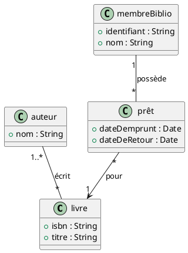

# Projet uJay
Le projet uJay est un réseau social de type nouveau permettant a des étudiants de publier des messages, de les commenter et de s’envoyer des notifications via une application mobile adossée à un serveur.
## Fonctionnalitées essentielles
+ S'inscrire
+ Se connecter
+ Publier des fils
+ Commenter sur les fils exsistants
+ Modifier/suprimmer ses messages
+ Réagir aux messages
+ Consulter les fils ultérieurs
## PUML aléatoire

## Tableau
| Étudiant | # Étudiant | Rôle |
| :------- | :---------: | :-----|
| Nicholas Buscombe | 300464101 | Scrum Master et UI/UX |
| Zen Canham | 300487696 | Serveur |
| Djymhabert G Louis | 300878888 | Serveur |
| Glory Ndaka Binoko | 300443714 | UI/UX |